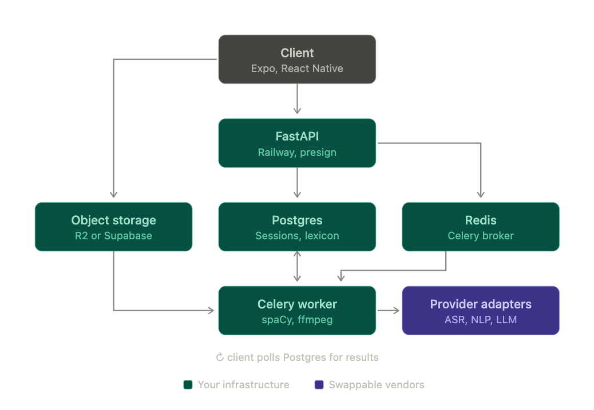
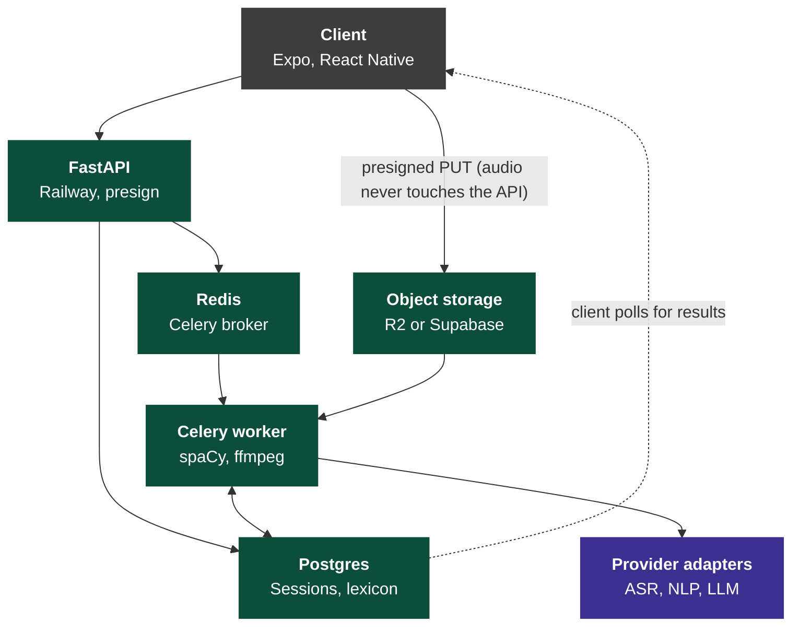

# Product Requirements Document

**Product:** Daily speaking practice *(working title — needs a name)*
**Owner:** Solo founder / engineer
**Status:** Draft v4 — supersedes v3
**Last updated:** July 2026

**Changes from v3:** ASR and NLP providers deferred — marked N/A pending selection. Vendor abstraction section removed. Open questions section removed.

---

## 1. Overview

### 1.1 Problem

A large group of people think more clearly than they speak. They know the material and what comes out is vague, repetitive, and badly ordered — the point buried three sentences in, the same six adjectives recycled, sentences that restart halfway through.

Two separable failures:

**Vocabulary.** Not how many words someone knows — how many they can *reach* mid-sentence. Most people's spoken register is far narrower than their written one. Under time pressure they fall back on a small set of vague placeholders: thing, stuff, good, bad, basically. **The precise word exists in their head. It just doesn't arrive in time.**

This is a retrieval problem, not a lexicon problem, and the distinction decides what the product trains. Teaching new words does nothing for someone whose words are already there. See `docs/product-brief.md`.

**Articulation.** The ordering problem. The point arrives late or never. No signposting. Sentences nest three clauses deep. Answers trail off instead of landing.

Both are measurable from a transcript. Both improve with daily practice. Neither is what existing tools focus on.

### 1.2 Vision

One minute of speaking a day that makes you use better words and put them in a better order.

### 1.3 Positioning

For people whose speaking doesn't represent how well they think, this is a daily practice that trains word choice and answer structure — where Yoodli, Orai, Speeko and Wellspoken train delivery.

---

## 2. Competitive landscape

Verified July 2026. Crowded, no breakout winner.

| Product | Focus | Headline metrics |
|---|---|---|
| Yoodli | Meetings, roleplay, enterprise | Pace, fillers, word choice, eye contact, hedging |
| Poised | Live overlay on real calls | Pace, fillers, tone, eye contact, confidence |
| Orai | Mobile curriculum, gamified | Pace, fillers, energy, clarity, confidence |
| Speeko | Voice refinement, daily exercises | Pace, fillers, intonation, word choice, pausing |
| Wellspoken | Workplace coaching, macOS | Filler rate, pace, clarity, hedging |
| VirtualSpeech | VR audience simulation | Delivery under simulated audience |
| ELSA / BoldVoice | Pronunciation, accent | Phoneme accuracy |
| Oratori | 30-second drill loops | Five-axis per-take scoring |
| Articulated | Individual mobile drills | Six-skill feedback |

**Read:** every competitor leads with delivery metrics. Word choice appears as a minor feature in two. Structure and organisation appear in none as a tracked, trending metric.

**Honest caveat:** this is differentiation of emphasis, not of category. A funded competitor could add structure scoring in a sprint. This wins on execution and taste or it doesn't win.

---

## 3. Goals and non-goals

### Goals
- **G1.** Measurably widen spoken vocabulary — more precise words, fewer vague placeholders.
- **G2.** Measurably improve answer structure — point-first, signposted, followable sentences.
- **G3.** Sustain a daily habit that reliably takes under five minutes.
- **G4.** Report progress against the user's own history, never a population average.

### Non-goals
- Circumlocution / missing-word inference *(cut in v2, stays cut)*
- Pronunciation and accent training
- Live in-meeting overlay
- Video analysis *(P2 only, as a monthly checkpoint)*
- Mock interviews, roleplay, VR
- Enterprise or team dashboards

---

## 4. Target user

**Primary.** Late 20s–40s knowledge worker, fluent English, reads and writes well. Consistently feels their spoken self undersells them. Pain moments: standups, being put on the spot, explaining their work upward, conversations that trail off.

**Secondary.** Fluent non-native English speakers with the same written-to-spoken gap. Don't build for them explicitly; don't break for them.

**Not the user.** Clinical speech or language disorders; anxiety as the primary barrier; beginners in English.

---

## 5. Principles

1. **Compare the person to themselves.** No population benchmarks.
2. **One instruction per session.** Metrics available on request; only one thing pushed.
3. **Production over recognition.** Every vocabulary interaction requires speaking aloud. Never multiple choice.
4. **Natural over impressive.** Suggested words must pass unnoticed in real conversation.
5. **Feedback from what was said.** Every observation traces to actual words in the transcript.
6. **Under five minutes, every day, no exceptions.** The moment a session runs long, the habit dies.

---

## 6. The daily ritual

**This is the product. Everything else is support.**

Hard budget: **one minute of speaking, under five minutes total, door to door.** Five minutes is the ceiling, not the target — a typical session should land near three.

| Step | Time | What happens |
|---|---|---|
| 1. Notification | — | One push at the user's chosen time |
| 2. Open → prompt | 5s | Today's prompt is already on screen. No menu, no mode select, no configuration. |
| 3. Record | **60s** | One take. Hard stop at 60 seconds. |
| 4. Processing | 10–20s | Progress state while the pipeline runs |
| 5. Results | 45s | Delivery, vocabulary, articulation, then **one** instruction |
| 6. Word of the day | 30s | One word; user speaks a sentence using it; verified |
| 7. Review drills | 45s | Up to 3 due words from the lexicon, spoken aloud |
| **Total** | **~3 min** | Ceiling of 5 min under any circumstances |

**Rules that protect the budget:**

- 60 seconds is a hard stop, not a suggestion. No "go long" mode.
- Steps 6 and 7 are skippable with one tap. Skipping does not break the day's streak — only the recording counts as completing the day.
- Review drills are capped at 3 regardless of how many are due. Overflow rolls forward.
- If total median session time exceeds 4 minutes in production, cut scope. Treat it as a bug.

**Minimum viable day:** open, record 60 seconds, close. Everything after step 5 is optional. A user who only ever does steps 1–5 is a successful user.

---

## 7. Features

### P0 — v1 (target 4 weeks)

#### F1. Auth
Email + password. Timezone captured at signup (drives notification time and day boundaries). In-app account deletion with real hard-delete (§11).

#### F2. Prompts
~120 seeded prompts weighted toward **explanation and opinion** — that's where vocabulary and structure fail. One per user per day, deterministic from `(user_id, date)`, no repeat within 60 days.

Good: *"Explain something from your job to someone outside your field."* / *"What's an opinion you hold that most people around you don't?"*
Bad: *"Tell me about your weekend."*

#### F3. Recording
- **60 seconds max**, hard stop, 10s visual warning. 15s minimum or reject with retry.
- Live waveform so the user knows it's capturing.
- Constraints: `echoCancellation: false`, `noiseSuppression: false`, `autoGainControl: false`, mono. **Log applied settings** — platforms silently ignore unsupported constraints.
- One retake per session; the discarded take is still stored.

**Acceptance:** survives app backgrounding mid-record; failed upload retries on next open without data loss.

#### F4. Transcription
Verbatim output with word-level timestamps. Disfluencies must be explicitly requested — every major provider strips them by default.

Provider to be selected. Accessed through an internal interface rather than called directly from product code.

#### F5. Delivery metrics *(table stakes, displayed but not emphasised)*

| Metric | Definition |
|---|---|
| Filler rate | Fillers per 100 words |
| Pace curve | WPM over rolling 10s window — a curve, not one number |
| Pause map | Inter-word gaps >400ms, classified pre-content-word vs clause-boundary |
| Hedging density | Fixed lexicon: "sort of", "I think maybe", "kind of", "I guess" |

#### F6. Vocabulary metrics *(core)*

| Metric | Definition | Notes |
|---|---|---|
| Lexical diversity | **MTLD or MATTR** | **Critical:** plain type-token ratio falls mechanically with length, so sessions of different lengths aren't comparable. Length-robust measures are required or the baseline is meaningless. |
| Vague-word density | Fixed list: thing, stuff, good, bad, nice, very, really, a lot, basically | Deterministic |
| Repetition | Content words used ≥3× in one session | Excludes function words and topic nouns |
| Word upgrades | 2–3 words they used, with stronger in-context alternatives | LLM; constraints below |

**Word upgrade constraints (non-negotiable):**
- Operate only on words actually spoken. No inference about intent.
- Alternatives must be conversationally natural. Reject the ornate synonym.
- Always show the original sentence for context.
- Return fewer or none rather than pad to a quota.

#### F7. Articulation metrics *(core)*

| Metric | Definition |
|---|---|
| Point placement | Which sentence carries the main claim, as a fraction through the answer. Earlier is better. |
| Signposting | Presence of structural markers ("three reasons", "first", "the key thing is") |
| Clause length + subordination depth | Long nested sentences are hard to follow. spaCy dependency parse. |
| Ending strength | Clean close / fade / abrupt stop |

Point placement, signposting and ending are LLM-scored. Clause metrics are computed from the parse tree — deterministic, no model.

**Every LLM score must cite the specific sentence behind it.** A number with no evidence doesn't ship.

#### F8. Session result
Metrics, then **one** written instruction. Not a summary — an instruction: *"Your point arrived in sentence five. Try leading with it."*

#### F9. Word of the day

**Design note:** as a passive card this teaches recognition, and recognition doesn't transfer to speech. Production is what makes it real.

**Selection priority:** (1) a word from the user's lexicon due for review, (2) a curated word semantically adjacent to what they actually talk about, derived from transcript history, (3) curated general fallback.

**Curated bank:** ~800 words at seed, tagged by domain and register. Inclusion test: *could a well-read person say this in a meeting without anyone noticing?* If no, it's out.

**Interaction:** word + short definition + one example → **user speaks a sentence using it** → ASR verifies the word was produced, LLM checks the usage is sensible → accepted words enter the lexicon on a spaced schedule. Rejection explains why, allows one retry, then moves on without penalty.

**Kill criterion:** if learned words don't appear unprompted in spontaneous recordings after 90 days, cut the feature.

#### F10. Lexicon and spaced review
Words enter with source context and a schedule: 1 → 3 → 7 → 21 days. Correct spoken production advances; failure resets to 1 day. Retired after two successes at 21 days. Max 3 cards per session.

#### F11. Baselines
Nightly per-user job computing rolling **medians** (not means) over 7/30/90 days. Requires ≥7 sessions before any comparison is displayed.

#### F12. History and playback
List view; detail view with word-aligned transcript synced to audio. Repeated and vague words highlighted inline.

#### F13. Notifications
One daily push at the user's chosen time. No streak-shaming copy. Never more than one per day.

### P1 — after v1 validates
- **Prosody** — F0 contour (uptalk), intensity contour (trailing off) via `praat-parselmouth`. Strengthens ending-strength with acoustic evidence. Trivial to add now that the backend is Python.
- **Streaming ASR / instant feedback** — pace and filler count the moment recording stops. Retention optimisation, not a validation requirement.
- **Themed vocabulary tracks** — user picks a domain and the curated bank narrows.

### P2 — later
- **Monthly video checkpoint.** Daily audio, once a month on camera to watch back. Frequent low-stakes reps, periodic high-fidelity review. Keeps daily friction at zero.
- **Real conversation capture** — coaching on actual meetings. Highest value available; gated on jurisdiction-specific recording-consent law. Needs legal advice.

**On video:** audio metrics are objectively defensible — clause length and filler rate are counts. Visual "presence" is not; what reads as confident posture is culturally specific and the research is weak. If video ships, it shows *observations* (how often gaze left the camera), not judgments (a confidence score).

---

## 8. Success metrics

### The one that decides everything
**D4 retention** — of users who complete one recording, the percentage who record again on day 4.

### Supporting

| Metric | Why |
|---|---|
| Median session duration | Must stay under 4 minutes. Over that is a bug. |
| Time to first recording | Onboarding friction. Target <90s. |
| Unprompted reuse rate | % of learned words appearing in later spontaneous recordings. **The real outcome measure**, and nothing in this category reports it. |
| Lexical diversity trend | Does vocabulary actually widen? |
| Point-placement trend | Does structure actually improve? |
| Word upgrade acceptance | Suggestion quality proxy |

### Not a goal
Filler rate improvement. It's the category's vanity metric.

---

## 9. Architecture





Green is infrastructure we run. Purple is swappable vendors, reached only through the adapter layer so no product code imports a provider SDK directly.

### 9.1 Stack

Python end to end. Every library the analysis needs lives there, and one language for a solo operator beats a polyglot split.

| Slot | Choice | Why |
|---|---|---|
| Client | Expo / React Native | Daily habit needs push notifications and background audio; iOS PWAs have neither |
| Capture | `expo-audio` | Real-time PCM, consistent WAV PCM across platforms |
| API | **FastAPI** on Railway or Fly | Same host as the worker. No serverless cold starts, no execution timeouts, one deploy, one log stream. |
| Worker | **Celery** | Retries, scheduling, and a beat scheduler for the nightly baseline job |
| Broker | **Redis** | Celery requires one. ~$10/month. |
| Database | **Postgres** | Sessions, transcripts, features, lexicon, baselines |
| Object storage | **Cloudflare R2** (or Supabase Storage) | R2 charges no egress — playback of the archive is free, and playback is the retention mechanic. Supabase Storage is the reasonable alternative if you'd rather run one vendor. Do not use raw S3. |
| Media | ffmpeg in the worker image | Transcode to 16kHz mono |
| NLP | **N/A** | Not yet selected |
| ASR | **N/A** | Not yet selected. Hard requirement when chosen: verbatim output with word-level timestamps. |
| LLM | Claude | Word upgrades, articulation scoring, instruction, usage validation |
| Errors | Sentry | Solo operator; silent worker death is otherwise invisible |

**Ingest:** client requests a presigned PUT, uploads direct to object storage, then POSTs the key. **The API never handles audio bytes.** Any client-side ASR token must be short-lived and server-minted.

### 9.2 Cost

~0.5 hr of audio per user per month at 60s/day. Roughly $0.20/user/month for transcription plus a few cents of LLM, based on current market rates. **Cost is not a constraint at this scale** — choose vendors on output quality, not price.

---

## 10. Data model

```
users            id, email, timezone, notify_at, created_at

prompts          id, text, category, active

recordings       id, user_id, prompt_id, storage_key, duration_ms,
                 captured_at, kind (session|drill|word_of_day),
                 is_retake, client_meta jsonb
                 -- IMMUTABLE. Source of truth.

transcripts      id, recording_id, transcript_version,
                 provider, model, words jsonb
                 -- words[]: { word, start, end, confidence, is_filler }

features         id, recording_id, feature_version, provider, model,
                 metrics jsonb
                 -- delivery + vocabulary + articulation

suggestions      id, recording_id, original_word, original_sentence,
                 suggested_word, status (pending|accepted|rejected)

vocab_bank       id, word, definition, example, domain, register

lexicon          id, user_id, word, origin (word_of_day|upgrade),
                 source_sentence, interval_days, due_at, streak,
                 state (learning|retired)

drill_attempts   id, lexicon_id, recording_id, attempted_at, success

baselines        user_id, metric, window_days, value, computed_at

insights         id, recording_id, focus_metric, body, provider, model
```

**Invariant:** `recordings` is immutable and permanent. Everything else is a cache rebuildable from raw audio. Never persist only derived numbers — retroactive re-analysis over a growing archive is the long-term thesis.

---

## 11. Privacy, legal, safety

- Voice recordings are treated as biometric data under several privacy regimes. Encrypt at rest, single region, documented retention.
- **Hard delete must actually work.** Cascade every table from `user_id` and sweep object storage. Build and test in v1.
- **No clinical framing.** Training tool, not therapy or speech-language pathology. Include a line directing users with persistent word-finding difficulty to a qualified professional — sudden-onset difficulty can indicate a medical issue.
- Recording other people requires jurisdiction-specific consent handling. Not without legal advice.
- Publish plain-language retention and deletion policy before launch.

---

## 12. Risks

**R1 — Differentiation is thin.** "Better word choice and structure" is an emphasis difference, not a moat. Wins on execution or not at all.

**R2 — Vocabulary gains may not transfer.** Spaced production should make words retrievable; generalisation to unrehearsed conversation is an assumption. The unprompted-reuse metric measures it directly.

**R3 — Articulation scoring may be unreliable.** "Where is the main point" is a judgment an LLM will answer confidently whether or not it's right. Require sentence citations; spot-check 20 recordings manually before shipping.

**R4 — Physical context.** Speaking aloud alone requires privacy. Unlike every successful mobile habit app, this can't be done on a commute, in an open office, or in bed. Structurally limits daily trigger moments. Applies to every competitor too.

**R5 — Distribution.** Twelve-plus competitors, several funded, fighting the same search terms. Engineering is not the bottleneck.

**R6 — Diversity metrics on 60 seconds.** MTLD is noisy on short samples, and dropping from 90s to 60s makes this worse. Validate before showing a per-session diversity number; the 7-day rolling median may be the shortest meaningful window.

---

## 13. Milestones

| Phase | Duration | Exit criterion |
|---|---|---|
| **M0 — ASR selection** | 1 day | 5 recordings of own voice through candidate providers. Pick one. |
| **M1 — Analysis harness** | 3 days | Offline script: audio → all vocabulary + articulation metrics. Manually verify against 20 recordings. |
| **M2 — P0 app** | 4 weeks | Daily loop shipped, self-used daily, 15 external testers |
| **M3 — Measure** | 4 weeks | D4 retention and median session duration readable |
| **M4 — P1** | — | Only if M3 justifies continuing |

**M0 and M1 come before app code.** Four days total, and M1 can invalidate the articulation metrics before a UI exists around them.
