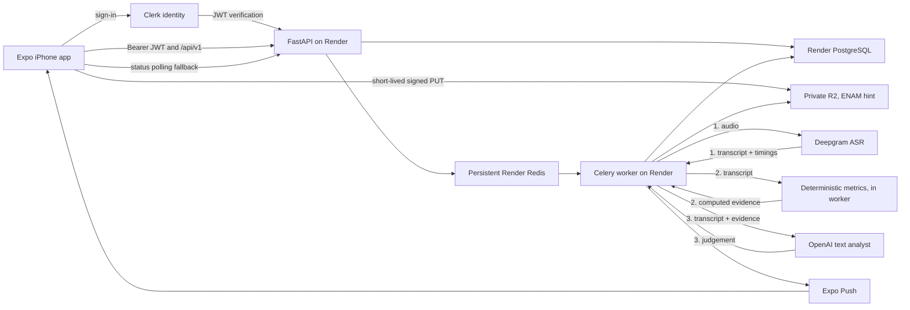

# Product Requirements Document

**Product:** Cadence
**Owner:** Solo founder / engineer
**Status:** Draft v6 — product requirements and production-MVP architecture confirmed
**Last updated:** August 2026

**Changes from v5:** Approves the production-MVP architecture and delivery
contracts: Clerk identity; Render compute, PostgreSQL, and Redis; private R2
audio; Celery workers; Deepgram transcription; deterministic Python metrics;
OpenAI text analysis; an encrypted mobile outbox; versioned REST/OpenAPI
contracts; isolated environments; explicit recovery, privacy, and model-quality
gates. Product scope remains the invite-only, iPhone-first beta defined in v5.

---

## 0. Document authority

This document is the product source of truth. It states **what Cadence must do**
and the constraints the implementation must satisfy.

Supporting documents retain depth but do not override this PRD:

- `docs/asr-research.md` — time-sensitive vendor and measurement research
- `docs/design-direction.md` — visual rationale and reference interpretation
- `docs/onboarding-spec.md` — historical screen-level notes, superseded where it conflicts here
- `docs/product-brief.md` — product narrative, consolidated here
- `CLAUDE.md` — current repository state and engineering gotchas, not product scope

Section 9 is the approved production-MVP architecture. `docs/architecture.png`
is a derived illustration and must be regenerated when §9 changes; it is never
authoritative on its own. Section 9.1 separately records what exists today so
prototype reality is not confused with the target.

### 0.1 Release boundary

- Invite-only beta capped at 50 external testers; all 50 invitations may be
  released together once the launch gates pass
- Adults 18+ in the United States and Canada
- English only, supporting major native and fluent non-native accents
- iPhone first; Android and web are not supported MVP clients
- Free throughout the beta; billing is deferred until retention is validated
- Primary audience: knowledge workers whose spoken communication undersells
  their thinking. Other fluent adults may benefit, but do not drive MVP trade-offs.

### 0.2 Confirmed MVP outcome

After sustained practice, users should speak with more precise words and place
their main point earlier. The MVP does **not** claim to have measured improvement
over time. It provides specific feedback on each session and separately records
whether the user maintained the practice habit.

## 1. Overview

### 1.1 Problem

A large group of people think more clearly than they speak. They know the material and what comes out is vague, repetitive, and badly ordered — the point buried three sentences in, the same six adjectives recycled, sentences that restart halfway through.

Two separable failures:

**Vocabulary.** Not how many words someone knows — how many they can *reach* mid-sentence. Most people's spoken register is far narrower than their written one. Under time pressure they fall back on a small set of vague placeholders: thing, stuff, good, bad, basically. **The precise word exists in their head. It just doesn't arrive in time.**

This is a retrieval problem, not a lexicon problem, and the distinction decides what the product trains. Teaching new words does nothing for someone whose words are already there. See `docs/product-brief.md`.

**Articulation.** The ordering problem. The point arrives late or never. No signposting. Sentences nest three clauses deep. Answers trail off instead of landing.

Both are measurable from a transcript. Both improve with daily practice. Neither is what existing tools focus on.

### 1.2 Vision

One minute of speaking a day that makes you use better words and put them in a better order.

### 1.3 Positioning

For people whose speaking doesn't represent how well they think, this is a daily practice that trains word choice and answer structure — where Yoodli, Orai, Speeko and Wellspoken train delivery.

---

## 2. Competitive landscape

Verified July 2026. Crowded, no breakout winner.

| Product | Focus | Headline metrics |
|---|---|---|
| Yoodli | Meetings, roleplay, enterprise | Pace, fillers, word choice, eye contact, hedging |
| Poised | Live overlay on real calls | Pace, fillers, tone, eye contact, confidence |
| Orai | Mobile curriculum, gamified | Pace, fillers, energy, clarity, confidence |
| Speeko | Voice refinement, daily exercises | Pace, fillers, intonation, word choice, pausing |
| Wellspoken | Workplace coaching, macOS | Filler rate, pace, clarity, hedging |
| VirtualSpeech | VR audience simulation | Delivery under simulated audience |
| ELSA / BoldVoice | Pronunciation, accent | Phoneme accuracy |
| Oratori | 30-second drill loops | Five-axis per-take scoring |
| Articulated | Individual mobile drills | Six-skill feedback |

**Read:** every competitor leads with delivery metrics. Word choice appears as a minor feature in two. Structure and organisation appear in none as a tracked, trending metric.

**Honest caveat:** this is differentiation of emphasis, not of category. A funded competitor could add structure scoring in a sprint. This wins on execution and taste or it doesn't win.

---

## 3. Goals and non-goals

### Goals
- **G1.** Give evidence-backed session feedback on spoken vocabulary — more
  precise words and fewer vague placeholders.
- **G2.** Give evidence-backed session feedback on answer structure —
  point-first, signposted, followable sentences.
- **G3.** Sustain a daily habit that reliably takes under five minutes.
- **G4.** Report progress against the user's own history, never a population average.

### Non-goals
- Circumlocution / missing-word inference *(cut in v2, stays cut)*
- Pronunciation and accent training
- Accent reduction or population benchmarking
- Live in-meeting overlay
- Video analysis *(P2 only, as a monthly checkpoint)*
- Mock interviews, roleplay, VR
- Enterprise or team dashboards
- Performance-over-time charts, baselines, or improvement claims in the MVP
- Word of the day, spaced vocabulary reviews, or speech-verified vocabulary drills in the MVP
- Payments, social features, sharing, leaderboards, and custom prompts in the MVP

---

## 4. Target user

**Primary.** Late 20s–40s knowledge worker, fluent English, reads and writes well. Consistently feels their spoken self undersells them. Pain moments: standups, being put on the spot, explaining their work upward, conversations that trail off.

**Secondary.** Fluent non-native English speakers with the same written-to-spoken gap. Don't build for them explicitly; don't break for them.

**Not the user.** Clinical speech or language disorders; anxiety as the primary barrier; beginners in English.

---

## 5. Principles

1. **Compare the person to themselves.** No population benchmarks.
2. **One instruction per session.** Metrics available on request; only one thing pushed.
3. **Production over recognition.** Every vocabulary interaction requires speaking aloud. Never multiple choice.
4. **Natural over impressive.** Suggested words must pass unnoticed in real conversation.
5. **Feedback from what was said.** Every observation traces to actual words in the transcript.
6. **Under five minutes, every day, no exceptions.** The moment a session runs long, the habit dies.
7. **Never guess a metric.** If audio or model confidence is insufficient, hide the value and explain why.
8. **Activity is not improvement.** A completed-day calendar may show habit consistency; it must never imply that darker days mean better speech.
9. **Sensitive content is not coaching scope.** Analyse wording and structure, never the user's beliefs, health, politics, religion, or inferred traits.

---

## 6. The daily ritual

**This is the product. Everything else is support.**

Hard budget: **one minute of speaking, under five minutes total, door to door.** Five minutes is the ceiling, not the target — a typical session should land near three.

| Step | Time | What happens |
|---|---|---|
| 1. Notification | — | One push at the user's chosen time |
| 2. Open → prompt | 5s | Today's prompt is already on screen. No menu, no mode select, no configuration. |
| 3. Record | **15–60s** | One chosen take. Hard stop at 60 seconds. One optional retake before saving. |
| 4. Processing | stretch 3–5s typical; p95 ≤30s | Durable background job. The user may leave safely. |
| 5. Results | 45–90s | One instruction first, then evidence, upgrades, structure, metrics, and transcript. |
| **Total** | **~2–3 min** | Ceiling of 5 min under normal circumstances |

**Rules that protect the budget:**

- 15 seconds is the minimum accepted take; 60 seconds is the hard stop.
- One optional retake is allowed. The discarded take is deleted immediately and
  never uploaded, analysed, or retained.
- A system interruption does not consume the retake. The interrupted take is discarded.
- Recording continues safely if the phone locks or the user briefly switches apps.
- Up to three new sessions—three distinct UUIDv7/idempotency keys—are allowed
  per account and current local calendar day.
- Only the first qualifying completion fills the activity calendar for that day;
  additional sessions never increase its intensity.
- One alternate curated prompt is allowed per day. No custom prompts.
- **Qualifying completion:** the server has accepted and verified the chosen
  take's upload and created its canonical session row. Analysis may still be in
  progress. The first qualifying completion marks daily activity.
- If total median session time exceeds 4 minutes in production, cut scope. Treat it as a bug.

**Minimum viable day:** open, record, and reach a qualifying completion. Results
may finish in the background. A user who returns later to read them is still
successful.

### 6.1 Failure and offline rules

- The user may record offline. Audio and metadata enter a durable on-device queue.
- Upload and analysis retry automatically when connectivity returns.
- If authentication cannot refresh, keep the outbox queued, preserve the audio,
  and prompt the user to sign in again.
- Closing or killing the app must not lose a valid chosen take.
- A repeatedly failed analysis remains a visible, retryable session with its audio intact.
- Never require the user to repeat a take because of a network, API, worker, or vendor failure.
- If the user leaves while processing, show persistent in-app status and send a
  result-ready push notification whose deep link opens that session.
- Stretch target: a typical full result is ready in 3–5 seconds.
- Service objective: 95% of analyses complete within 30 seconds under normal
  provider operation. Slower work continues safely in the background; 30
  seconds is not a destructive timeout.

### 6.2 Onboarding flow

1. **Invitation and sign-in.** Open the invite, enter email, verify the one-time
   link/code. No password.
2. **Frame.** Two short lines: what Cadence does and why it is not another
   filler-word counter. One action forward.
3. **Context.** “Where does this bite you most?” Meetings, presentations,
   interviews, or everyday conversation. One tap advances and weights prompts.
4. **Recording notice.** Plain-language cloud/vendor/retention notice plus
   Terms and Privacy acceptance before the microphone flow can upload anything.
5. **First prompt and recording.** Request microphone permission only when the
   user taps Record.
6. **Processing.** Rotate short explanations of word choice, point placement,
   and why filler count is secondary. First session only.
7. **First result.** Full result without longitudinal comparisons.
8. **Reminder.** Ask when the user is somewhere they can speak aloud, then
   request notification permission and schedule the chosen local time.
9. **Today.** Enter the normal daily surface.

Target: first recording begins within 90 seconds of opening the invitation,
excluding time spent retrieving the email code.

---

## 7. Features

### P0 — production MVP

#### F1. Auth
Clerk provides invite-only, passwordless email sign-in using a one-time link or
code. Sign-in happens before onboarding and the first recording. Cadence owns
its internal user UUID and maps the Clerk subject to it, so identity can be
migrated without changing ownership throughout the product.

The founder issues a single-use, expiring invitation. It must be redeemed before
FastAPI provisions the internal account or permits session creation. Clerk
verifies identity; Cadence's invitation/account record enforces beta admission
and disabled-account status on every authenticated request.

- The app follows the device's current local timezone for daily completion and reminders.
- Timezone changes while travelling update day boundaries without double-counting one instant as two days.
- Accounts own all sessions, recordings, transcripts, feedback, and activity records.
- One account may use multiple iPhones. Cloud history and the three-session
  daily quota apply account-wide, not per installation.
- Individual-session deletion and full account deletion are required (§11).
- A previously signed-in user may record while offline under the cached account,
  but upload requires refreshed authentication.
- Signing out with pending recordings requires an explicit keep-for-this-account
  or delete choice. Pending content is never transferred to another account.

#### F2. Prompts
~120 seeded prompts weighted toward **explanation and opinion** — that's where
vocabulary and structure fail. Prompt selection is deterministic per user and
local day, weighted toward the speaking context chosen in onboarding, retains
some cross-context variety, and never repeats within 60 days.

The server creates the authoritative daily assignment; the client displays and
caches it but never independently chooses the canonical prompt.

The user may swap today's prompt once. The replacement becomes the official
prompt for that day. Users cannot submit custom prompts in the MVP.

Good: *"Explain something from your job to someone outside your field."* / *"What's an opinion you hold that most people around you don't?"*
Bad: *"Tell me about your weekend."*

#### F3. Recording
- **60 seconds max**, hard stop, 10s visual warning. 15s minimum or reject with retry.
- Live waveform so the user knows it's capturing.
- Constraints: `echoCancellation: false`, `noiseSuppression: false`, `autoGainControl: false`, mono. **Log applied settings** — platforms silently ignore unsupported constraints.
- One optional retake before saving; the discarded take is deleted immediately.
- Continue recording through a screen lock or brief app switch.
- A phone call, alarm, or system audio interruption discards the interrupted take
  and restores the retake allowance.

**Acceptance:** survives app backgrounding mid-record; records offline; failed
upload retries across app restarts without data loss; never stores a cache URI
as the session's durable audio reference.

#### F4. Transcription
Verbatim output with word-level timestamps. Disfluencies must be explicitly requested — every major provider strips them by default.

**Production direction:** Deepgram is the production ASR for the beta, with
model-improvement opt-out enabled on every request. ElevenLabs may be benchmarked
offline using only synthetic or separately consented evaluation audio. Customer
recordings are never duplicated across ASR vendors, and switching the production
provider requires a new architecture, privacy, and quality decision.

The provider remains behind an internal interface. No product code imports a
vendor SDK directly.

#### F5. Delivery metrics *(table stakes, displayed but not emphasised)*

| Metric | Definition |
|---|---|
| Filler rate | Fillers per 100 words |
| Word count | Total transcribed words |
| Pace | Average WPM; a pace curve may be added only if it remains readable and reliable |
| Pause map | Inter-word gaps classified pre-content-word vs clause-boundary; threshold validated on Cadence audio |
| Hedging density | Fixed lexicon: "sort of", "I think maybe", "kind of", "I guess" |

These numbers describe **this recording only**. The MVP never labels them as
good, bad, improved, or regressed. Filler rate remains visually secondary.

#### F6. Vocabulary metrics *(core)*

| Metric | Definition | Notes |
|---|---|---|
| Lexical diversity | **MATTR, 25-word window** | **Critical:** plain type-token ratio falls mechanically with length, so sessions of different lengths aren't comparable. Short sessions below the reliability floor hide the value rather than substituting another measure. |
| Vague-word density | Fixed list: thing, stuff, good, bad, nice, very, really, a lot, basically | Deterministic |
| Repetition | Content words used ≥3× in one session | Excludes function words and topic nouns |
| Word upgrades | 2–3 words they used, with stronger in-context alternatives | LLM; constraints below |

**Word upgrade constraints (non-negotiable):**
- Operate only on words actually spoken. No inference about intent.
- Alternatives must be conversationally natural. Reject the ornate synonym.
- Always show the original sentence for context.
- Return fewer or none rather than pad to a quota.

#### F7. Articulation metrics *(core)*

| Metric | Definition |
|---|---|
| Point placement | Which sentence carries the main claim, as a fraction through the answer. Earlier is better. |
| Signposting | Presence of structural markers ("three reasons", "first", "the key thing is") |
| Clause length + subordination depth | Long nested sentences are hard to follow. spaCy dependency parse. |
| Ending strength | Clean close / fade / abrupt stop |

Point placement, signposting and ending are LLM-scored. Clause metrics are computed from the parse tree — deterministic, no model.

**Every LLM score must cite the specific sentence behind it.** A number with no evidence doesn't ship.

The production text analyst is OpenAI, text-only. Gemini remains development and
test-only and must not receive customer content. Evaluate eligible OpenAI models
against the same versioned set and select the fastest, least expensive model that
passes the coaching-quality gate; model prestige is not a requirement.

The gate contains at least 50 diverse synthetic or separately consented
recordings with exact transcripts and fixed human rubrics. It requires 100%
schema-valid output, no critical unsupported coaching claim, and predefined ASR
and coaching thresholds. Standard API data is never opted into training.

#### F8. Session result
Ordered by behavioural impact:

1. **One instruction**, large and first. Not a summary or generic encouragement.
2. **Word upgrades**, each shown in the original sentence.
3. **Structure and self-repairs**, with the main-point sentence and any cited
   false start/reformulation evidence quoted.
4. **Vocabulary**, including numerical session metrics.
5. **Delivery**, including numerical session metrics, visually secondary.
6. **Transcript** and audio playback. Word-synchronised highlighting is deferred.
7. **Feedback controls:** accurate/inaccurate and useful/not useful, plus an optional comment.

Every metric has a concise label and a tappable explanation covering its
definition, calculation, and limitations. If a value is unreliable for this
recording, hide it and explain why; never substitute an estimate.

### Deferred feature contracts — post-MVP

#### F9. Word of the day

**Design note:** as a passive card this teaches recognition, and recognition doesn't transfer to speech. Production is what makes it real.

**Selection priority:** (1) a word from the user's lexicon due for review, (2) a curated word semantically adjacent to what they actually talk about, derived from transcript history, (3) curated general fallback.

**Curated bank:** ~800 words at seed, tagged by domain and register. Inclusion test: *could a well-read person say this in a meeting without anyone noticing?* If no, it's out.

**Interaction:** word + short definition + one example → **user speaks a sentence using it** → ASR verifies the word was produced, LLM checks the usage is sensible → accepted words enter the lexicon on a spaced schedule. Rejection explains why, allows one retry, then moves on without penalty.

**Kill criterion:** if learned words don't appear unprompted in spontaneous recordings after 90 days, cut the feature.

The MVP does not ship a word-of-the-day exercise, tap-to-confirm substitute, or
spoken vocabulary drill. Preserve the research and interaction contract for a
later validated feature.

#### F10. Lexicon and spaced review
Words enter with source context and a schedule: 1 → 3 → 7 → 21 days. Correct spoken production advances; failure resets to 1 day. Retired after two successes at 21 days. Max 3 cards per session.

No lexicon or review scheduling ships in the MVP.

### P0 — production MVP continued

#### F11. Practice activity
A GitHub-style contribution calendar appears at the top of History:

- Rolling 12 months, grouped by week
- Binary completion only: the first qualifying completion fills the local day
- Additional attempts never increase intensity
- Shows total completed days, current streak, and longest streak
- Missing a local day resets the current streak
- Never colours days by speech quality or implies performance improvement

Performance baselines, 30/90-day metric charts, and improvement claims are
post-MVP feature requests. When revisited, use rolling medians and minimum
sample gates rather than the current prototype's first-week mean ± standard deviation.

#### F12. History and playback
Reverse-chronological list with no search or filters in the MVP. Detail view
contains the prompt, date, audio playback, transcript, instruction, upgrades,
structure feedback, and session metrics. Repeated, filler, and vague words are
highlighted inline. Users can flag an inaccurate transcript and optionally
identify the affected passage; editing and re-analysis are deferred.

#### F13. Notifications
After the first result, ask when the user is normally somewhere they can speak
aloud, then request permission. One optional daily push at the chosen local
time. No streak-shaming copy. Never more than one reminder per day.

Analysis-complete notifications are transactional and do not count against the
one-reminder limit. They go only to the submitting device and reveal no prompt
or speech content: **“Your Cadence result is ready.”** Tapping opens that session.

#### F14. Settings and account controls

- Change reminder time or disable reminders
- Choose whether recordings may upload over cellular data
- Clear the bounded playback cache without deleting cloud sessions
- Opt out of pseudonymous PostHog product analytics
- Choose light, dark, or system theme
- View account email and sign out
- View Privacy Policy, Terms, subprocessors, retention, and support-access rules
- Review/revoke active support-session shares
- Delete an individual session
- Request account deletion and see its status
- Self-service export is visibly deferred, not represented as available

Prototype-only sample-data and permission-preview controls must not appear in
production beta builds.

#### F15. Beta operations

A protected admin API plus a small authenticated CLI supports single-use,
expiring invitations, account status, failed-job inspection/retry, system
health/latency/AI cost, and deletion verification. Do not build a founder web
dashboard until repeated use justifies it. The tools do not provide default
access to customer audio, transcripts, or AI output.

### P1 — after v1 validates
- **Performance trends** — validated 30/90-day views and rolling medians, without population benchmarks.
- **Spoken vocabulary practice** — word of the day and spaced review only with real speech and usage verification.
- **Android client** — preserve the current recording-format asymmetry honestly and validate metric comparability.
- **Word-synchronised playback** — transcript highlighting and tap-to-seek from retained word timings.
- **Transcript correction and re-analysis** — version the user correction rather than overwriting the verbatim ASR output.
- **Prosody** — F0 contour and intensity evidence via `praat-parselmouth`, only after acoustic validation.
- **Streaming ASR / instant feedback** — pace and filler count the moment recording stops. Retention optimisation, not a validation requirement.
- **Themed vocabulary tracks** — user picks a domain and the curated bank narrows.

### P2 — later
- **Monthly video checkpoint.** Daily audio, once a month on camera to watch back. Frequent low-stakes reps, periodic high-fidelity review. Keeps daily friction at zero.
- **Real conversation capture** — coaching on actual meetings. Highest value available; gated on jurisdiction-specific recording-consent law. Needs legal advice.

**On video:** audio metrics are objectively defensible — clause length and filler rate are counts. Visual "presence" is not; what reads as confident posture is culturally specific and the research is weak. If video ships, it shows *observations* (how often gaze left the camera), not judgments (a confidence score).

---

## 8. Success metrics

### The one that decides everything
**D4 retention** — of invited users who complete one recording, the percentage
who complete another recording on day 4. Initial beta signal: **≥40%**, treated
as directional because a cohort capped at 50 is statistically small.

### Beta launch and exit signals

| Metric | Why |
|---|---|
| Median session duration | Must stay under 4 minutes. Over that is a product bug. |
| Time to first recording | Onboarding friction. Target <90s. |
| Analysis latency | Stretch: typical full result in 3–5s. Launch SLO: 95% of normal sessions ready within 30s; slower work continues in the background. |
| Upload recovery | Valid offline/failed takes survive restart and eventually process without re-recording. |
| Coaching accuracy | Per-session accurate/inaccurate rating plus optional comment. |
| Coaching usefulness | Per-session useful/not-useful rating plus optional comment. |
| Pipeline reliability | Completion, retry, and terminal-failure rates by stage without logging content. |
| Deletion completeness | Account deletion removes every owned database row and audio object and is auditable. |

### Not a goal
Filler-rate improvement, a composite speaking score, population ranking, or any
claim that the MVP has measured long-term speaking improvement.

### Product analytics policy

Collect the minimum events needed to evaluate the beta: invitation accepted,
onboarding completed, first recording started/completed, upload queued,
analysis completed/failed, result viewed, reminder enabled, session duration,
daily completion, and coaching feedback submitted.

PostHog receives a pseudonymous internal account ID after clear notice and
provides an opt-out in Settings. It does not receive Clerk identifiers.

Never send audio, transcript text, prompts, AI output, access tokens, email
addresses, or free-form comments to the analytics provider.

---

## 9. Approved production-MVP architecture

### 9.1 Current implementation

The working prototype remains:

```text
Expo iPhone app
  → multipart audio upload to one FastAPI endpoint
  → Deepgram Nova-3 transcription
  → deterministic Python metrics
  → Gemini text-only judgement
  → AsyncStorage session data + document-directory audio on one device
```

There is no production auth, server database, object storage, durable server
job queue, worker, CI/CD, product analytics, or error monitoring yet.
Gemini in this flow is prototype-only; OpenAI is the production analyst.

Section 9 defines the target, not the current repository state. The migration
must preserve the working three-stage analysis split and durable chosen-take
audio while replacing local-only state and the synchronous upload endpoint.

### 9.2 Runtime topology



- **Identity:** Clerk provides invite-only passwordless authentication. FastAPI
  validates Clerk JWTs and maps the subject to a Cadence-owned UUID.
- **Compute:** Separate Dockerized FastAPI web and Celery worker services run on
  Render in one private network.
- **Data:** Render PostgreSQL is the durable source of truth. Persistent Render
  Redis is the Celery broker only, never the result store or authoritative job state.
- **Objects:** Private Cloudflare R2 stores audio. The bucket uses the Eastern
  North America location hint; this improves proximity but is not a contractual
  Canada or exact-region residency guarantee.
- **Providers:** Deepgram receives audio. OpenAI receives only transcript text
  and computed evidence. Gemini is test-only; ElevenLabs is offline-benchmark-only.
- **Notifications:** Expo Push delivers generic completion messages to the
  submitting device. The open app polls the API because push is not guaranteed.
- **Portability:** Supabase is excluded. The design uses Docker, PostgreSQL,
  Redis, S3-compatible object APIs, REST/OpenAPI, and provider adapters so a
  managed component can be replaced without rewriting product logic.

The total recurring production operating cost for the 50-account beta must
remain at or below **$100/month**, including Render compute, PostgreSQL, Redis,
R2, Deepgram, OpenAI, and production monitoring. Apple Developer Program
membership, one-time legal review, and development tooling are excluded. M6's
load/cost test must prove the documented 50-account load profile can operate
inside this envelope. Raising the cap requires an explicit PRD decision.
Operational simplicity is preferred over scattering every component across a
different provider.

### 9.3 Mobile architecture

- TanStack Query owns cloud server state, caching, invalidation, and status polling.
  React Context remains for app-wide local concerns such as theme and onboarding,
  not as a second remote-session cache.
- Expo SQLite stores durable local sessions, sync metadata, and the upload
  outbox. Drizzle defines typed queries and bundled schema migrations.
- SQLCipher encrypts SQLite with a device-only key held in Expo SecureStore.
  Clerk tokens also use SecureStore and never AsyncStorage.
- Expo FileSystem stores audio; SQLite stores relative paths and metadata, not
  audio bytes. Pending and cached voice data are excluded from device backups.
- AsyncStorage remains only for small non-sensitive preferences and disposable
  caches that contain no transcript, coaching, token, or audio content.
- The playback cache retains at most 30 recent sessions or 100 MB, whichever is
  reached first, and evicts least-recently-used audio first.
- One sync manager runs at a time. It attempts work immediately after recording,
  on network reconnect, on app foreground, and through best-effort iOS background
  tasks. A force-quit may delay work, but reopening safely resumes it.
- Wi-Fi and cellular uploads are allowed by default, with a Wi-Fi-only setting.
- Pre-beta sample/development data is never uploaded automatically. If a real
  signed-in user has local sessions at migration, offer a one-time authenticated
  import; never silently attach local content to an account.

Creating a chosen take and its outbox operation is one SQLite transaction.
Deleting the upload outbox row is permitted only after upload confirmation
returns the canonical server session row; it does not wait for analysis to
finish. TanStack Query mutation persistence is not the durable recording outbox.

### 9.4 Backend and persistence

- FastAPI exposes versioned REST endpoints under `/api/v1`.
- Pydantic v2 validates API requests, responses, task payloads, and untrusted
  analyst output.
- SQLAlchemy 2 provides explicit typed PostgreSQL models and transactions;
  Psycopg 3 is the driver; Alembic owns reviewed schema migrations.
- Keep the data layer small: one session factory and direct service functions.
  Do not add generic repository, unit-of-work, CQRS, or event-sourcing frameworks.
  SQLAlchemy Core or explicit SQL remains available where clearer.
- PostgreSQL stores ownership, lifecycle state, queryable metrics, versions, and
  constraints relationally. Immutable nested coaching evidence and word timings
  use versioned JSONB. No unversioned all-purpose analysis blob is authoritative.
- Business logic stays outside Pydantic and ORM models. Public schemas never
  expose ORM records directly.
- spaCy runs inside the worker for deterministic clause length and subordination
  metrics; it is not a separate service.

### 9.5 Upload and analysis flow

1. The iPhone generates a UUIDv7 session ID and stable idempotency key, persists
   the chosen audio, and atomically creates its local outbox row.
2. `POST /api/v1/sessions` authorizes the owner and returns a short-lived,
   one-object, one-operation R2 upload URL.
3. The iPhone uploads directly to private R2 using the signed content type,
   length, and checksum. It holds no permanent R2 credential.
4. Upload confirmation causes FastAPI to verify object existence, ownership,
   size, type, and checksum.
5. PostgreSQL commits the session, analysis job, and server-outbox event in one
   transaction. An idempotent dispatcher publishes only the job ID to Redis.
6. Celery executes Deepgram → deterministic metrics → OpenAI. The result
   transaction commits before the broker message is acknowledged.
7. PostgreSQL records the canonical state. The app learns it through polling or
   a generic Expo Push deep link.

The client owns pre-server states:

```text
local → uploading
```

After verified upload confirmation, PostgreSQL owns:

```text
queued → transcribing → measuring → coaching → ready
   ↘ retrying → recoverable-failed
any server state → deleting → deleted
```

Provider or infrastructure failures retry with exponential backoff and jitter
for up to 24 hours. Audio remains safe. Exhausted work becomes recoverable-failed
and can be restarted without recording again. User or founder restart of the
same session/idempotency key does not consume daily quota. Reconciliation republishes a
PostgreSQL job whose Redis message was lost. Every operation is idempotent;
duplicate delivery must never create a duplicate session or analysis.

### 9.6 API and compatibility contract

The v1 contract covers:

- session creation, signed-upload grant, and upload confirmation
- session detail, reverse-chronological history, and analysis status/result
- cursor-based sync plus 30-day content-free deletion tombstones
- push-token registration and removal
- session feedback, individual deletion, and account deletion/status
- support-share creation/revocation and protected founder operations

FastAPI's OpenAPI schema generates the TypeScript mobile client. Handwritten
duplicated request/response interfaces are not authoritative. Errors use one
versioned problem shape while retaining compatibility with FastAPI `detail`.
Responses expose real stages, never a guessed percentage.

API and database changes use expand-then-contract migrations and support at
least the current and previous mobile release. Destructive contraction occurs
only after the compatibility window. Forced updates are reserved for a security
or data-integrity emergency.

### 9.7 Authorization and access

Every session, object, job, transcript, result, feedback record, and deletion
operation has explicit user ownership.

- FastAPI performs ownership checks and role authorization.
- PostgreSQL row-level security provides a second ownership boundary.
- Separate database roles exist for the API, worker, migrations, backups, and
  tightly scoped founder operations.
- Founder admin may invite users, view metadata/health, retry jobs, and verify
  deletion. It has no standing speech-content access.
- A support grant is user-created, limited to one session and stated purpose,
  expires automatically, is revocable, and is fully audited.
- Random object keys contain no email, prompt, or personal data. Object-key
  unpredictability never substitutes for authorization.

Security audit events record actor, action, target internal ID, timestamp,
outcome, and request ID without speech content, email, signed URLs, or tokens.
They are retained for one year; identity mappings are destroyed on account
deletion so historical internal IDs are no longer directly attributable.

### 9.8 Environments, delivery, and secrets

- Local, staging, and production have separate Clerk projects, PostgreSQL
  databases, Redis instances, R2 buckets, provider keys, and telemetry projects.
- Staging uses synthetic or separately consented evaluation data only.
- Dockerfiles and a Render Blueprint define backend services. GitHub Actions
  runs quality gates; production deployment requires manual approval. Alembic
  runs as a pre-deploy migration step.
- EAS Build/Submit produces the iPhone release.
- Render secret environment groups, EAS secrets, provider dashboards, and local
  gitignored environment files hold credentials. Production secrets do not live
  in GitHub and are never placed in `EXPO_PUBLIC_*` variables.
- Secrets are environment-specific and least-privilege, rotated after suspected
  exposure and on a documented schedule.

### 9.9 Observability, cost, and recovery

- **Sentry:** scrubbed mobile crashes and performance only; no screenshots or replay.
- **Logfire:** FastAPI, Celery, PostgreSQL, provider latency, retries, token usage,
  and backend exceptions through portable OpenTelemetry instrumentation.
- **PostHog:** controlled pseudonymous product events only.

None receives audio, transcript text, prompts, coaching, free-form feedback,
emails, Clerk subjects, authorization data, request bodies, or signed URLs.
OpenAI prompt/response capture and Pydantic request-value capture are explicitly
disabled in backend telemetry.

Each account may create at most three new session IDs per local day. Automatic
or manual retries of the same idempotent job do not count. Track actual spend
and projected month-end spend against the single $100 monthly operating cap;
alert at 50% and 80%. Before additional provider usage would exceed the cap,
pause new analysis while keeping fixed services available and preserving
recordings and queued work. Paused jobs remain visibly queued and resume at the
next monthly budget window or after an explicit PRD cap change.

Render point-in-time recovery is supplemented by a nightly encrypted logical
PostgreSQL backup in a separate private R2 backup bucket. Logical backups expire
after 14 days. A monthly restore test verifies **RPO ≤24 hours** and **RTO ≤4
hours**. R2 audio is not copied into PostgreSQL backups. Deletion disclosures
state that removed live data may persist only until the 14-day backup expiry.

### 9.10 Quality and launch gates

- Unit-test every deterministic metric, timezone/day rule, cache policy, and
  state transition.
- Contract/integration-test authentication, RLS/RBAC, signed uploads, outboxes,
  duplicate delivery, retries, provider normalization, sync, and deletion.
- Test app termination at every upload stage, offline recording, token expiry,
  reconnect, backgrounding, lost broker messages, and stale-device reconciliation.
- Maintain one real-device iPhone critical-path test and run Expo Doctor after
  native dependency changes.
- Run the versioned ≥50-record ASR/coaching evaluation before production model
  promotion. Quality and privacy are independent release gates.
- Load- and cost-test the system for all 50 invited testers before invitations
  are released together.
- Do not claim the 3–5-second stretch target until production-provider benchmarks
  demonstrate it without reducing coaching quality. Block launch if p95 exceeds
  30 seconds under normal operation, unsupported coaching reaches users, chosen
  takes can be lost, or deletion/recovery cannot be demonstrated.

Latency is measured end to end from recording stop through upload, transcription,
metrics, analysis, and committed result. Report each stage separately. “Normal
operation” means the client has a usable connection and no involved provider has
declared an incident; degraded periods remain visible in reliability reporting
but are segmented from the launch SLO.

### 9.11 Threat model

Protected assets are voice recordings, transcripts, coaching, account identity,
auth tokens, provider credentials, signed object URLs, and deletion/audit state.
Trust boundaries exist between the iPhone, Clerk, FastAPI, PostgreSQL/Redis, R2,
AI providers, telemetry providers, and founder operations.

The implementation and tests must address:

- cross-account access through IDOR, missing RLS context, or guessed object keys
- stolen, replayed, over-broad, or logged signed URLs and credentials
- duplicate, reordered, lost, or poisoned queue/outbox work
- stale devices resurrecting deleted content
- invitation, upload, analysis-quota, and budget abuse
- accidental speech-content capture in logs, analytics, crash reports, or traces
- founder/support access outside a valid audited grant
- dependency and build-pipeline compromise

Required mitigations are defined in §§9.3–9.10 and §11. The M1 threat-model
review must map every trust boundary and abuse case to an owner, control, test,
and residual-risk decision.

---

## 10. Data model

PostgreSQL owns cloud truth; encrypted SQLite owns unsent local work and bounded
offline cache state. The schema represents these concepts without collapsing
them into one unversioned JSON blob:

- **Invitations:** invited email, status, expiry, inviter, accepted account
- **Users:** identity-provider subject, email reference, locale, reminder time,
  speaking context, consent versions, created/deleted timestamps
- **Devices:** user, installation ID, push token reference, platform/app version,
  last seen, notification status, revoked timestamp
- **Prompts:** text, category/context tags, active state, content version
- **Daily assignments:** user, local day, primary prompt, optional replacement,
  timezone used, first qualifying completion
- **Recordings/sessions:** user, prompt, local day, capture instant, duration,
  storage key, checksum, format/device metadata, state, idempotency key
- **Analysis jobs:** session, stage, attempt count, retry schedule, provider error
  class, analysis version, started/completed timestamps, terminal state
- **Server outbox:** event ID, aggregate ID, event type/version, publication
  attempts, next attempt, published timestamp
- **Transcripts:** recording, version, provider/model, verbatim text, word timings,
  confidence, punctuation/disfluency metadata
- **Deterministic features:** recording, feature version, metric definitions,
  values, unavailable reasons, input provenance
- **Judgements:** recording, prompt/model/version, instruction, structure evidence,
  repairs, and normalised output
- **Word upgrades:** original word and sentence, suggestion and improved sentence
- **Session feedback:** accurate/inaccurate, useful/not useful, optional comment
- **Daily activity:** one binary completion per user and local day
- **Support shares:** explicit user grant for one session, purpose, expiry, revocation
- **Deletion jobs/audit:** requested scope, database sweep, object sweep, completion,
  and non-content evidence that deletion succeeded
- **Security audit events:** actor, action, target internal ID, request ID, outcome,
  and timestamp without customer content
- **Sync tombstones:** deleted entity ID and revision, retained without content
  for 30 days

Queryable ownership, lifecycle, version, and metric fields are relational.
Naturally nested immutable evidence—word timings, upgrades, repairs, pause maps,
and structure details—uses schema-versioned JSONB. The API never returns stored
JSONB without Pydantic normalization and validation.

**Invariants:**

1. A user can create at most three new session IDs for one local day. Automatic
   or manual retries of an existing session do not consume the quota. Only the
   first qualifying completion marks daily activity.
2. A recording becomes immutable once selected and uploaded. A discarded retake
   is deleted before upload and never becomes a recording row.
3. Raw audio is the source artifact for the chosen take. Derived transcripts,
   metrics, and judgements are versioned and rebuildable.
4. Every derived value records the provider/model or algorithm version that produced it.
5. Word timings and provider provenance are retained even though synchronized
   transcript playback is post-MVP.
6. User ownership is explicit on every data path; authorization never relies on
   an object key being hard to guess.
7. Deleting a session removes its audio and all derived records. Account deletion
   cascades through every owned record and queues an object-storage sweep.
8. A UUIDv7 session ID and stable idempotency key originate on the device.
   Replaying the same operation cannot create another session or analysis.
9. Session creation, analysis-job creation, and server-outbox creation commit in
   one PostgreSQL transaction.
10. Completed analyses are immutable. Reanalysis creates a new version and never
    silently rewrites historical output.
11. Calendar-day logic stores the UTC instant, device IANA timezone, and derived
    local day at capture. UTC date truncation is never used as a local-day rule.
12. Source transcripts remain immutable. User-reported corrections are separate
    records; editable display transcripts and reanalysis are post-MVP.
13. Deletion wins over stale-device updates. A device returning after the
    30-day tombstone window performs full reconciliation.

---

## 11. Privacy, legal, safety

### 11.1 Consent and data use

- Treat voice as sensitive biometric-adjacent data regardless of the minimum legal classification.
- Before the first upload, show a short plain-language notice explaining cloud
  storage, Deepgram transcription, OpenAI text analysis, retention until deletion,
  and who can access content. Terms and Privacy acceptance follow.
- Research/product-improvement consent is separate, explicit, optional, and off by default.
- Do not train vendor models on customer content.
- Do not use customer audio or transcripts internally for evaluation without the
  separate opt-in.
- Every Deepgram request sets `mip_opt_out=true`. Deepgram then retains request
  content only for the duration needed to process it and does not use it for
  model improvement; verify the flag in production request logs.
- Standard OpenAI API retention is temporarily permitted while Zero Data
  Retention approval is pending. The notice must say that transcripts are not
  used for training but may remain in abuse-monitoring logs for up to 30 days.
  Optional application storage stays disabled. Switch to ZDR after approval and
  verify the setting on the production project and endpoint.
- Complete the applicable US and Canadian beta legal/privacy review before
  releasing any invitation to an external tester.
- Publish plain-language retention, deletion, subprocessors, and support-access
  policies before inviting external testers.

### 11.2 Storage and retention

- Encrypt data in transit and at rest.
- Encrypt the on-device SQLite database with SQLCipher and a device-only
  SecureStore key. Keep pending and cached voice data out of device backups.
- Keep the chosen recording, transcript, and feedback until the user deletes the
  session or account. Do not retain discarded retakes.
- Use R2's Eastern North America location hint while disclosing that it is
  best-effort proximity, not guaranteed Canadian or exact-region residency.
- Live data is removed before backup expiry; encrypted logical backups expire
  after 14 days. The deletion policy must state that maximum plainly.
- Provider retention must be the shortest available and contractually documented.

### 11.3 User control

- Individual session deletion removes audio and every derived record.
- Account deletion removes profile, sessions, audio, transcripts, feedback,
  assignments, activity, and provider-side artifacts where deletion APIs exist.
- Explicit account deletion disables access immediately and completes live
  PostgreSQL, R2, Clerk-mapping, and provider-side deletion within 24 hours.
  There is no recovery grace period. Backup copies expire within 14 days.
- Self-service data export is post-MVP, but deletion is not.
- Deletion is tested end to end and produces a content-free audit result.

### 11.4 Human access

- Founder/support staff have no standing access to recordings or transcripts.
- A user may explicitly share one session for a defined support purpose.
- The grant is scoped, time-limited, visible, and revocable.
- Operational dashboards expose metadata and health, not session content.

### 11.5 Safety boundaries

- **No clinical framing.** Cadence is training, not therapy or speech-language pathology.
- Keep one quiet referral note directing persistent word-finding difficulty to a
  qualified professional.
- Never diagnose from speech or infer health, politics, religion, ethnicity,
  sexuality, or other sensitive traits.
- For explicit imminent-harm content, replace ordinary coaching with a narrowly
  appropriate crisis notice; do not attempt counselling.
- Analyse sensitive topics for wording and structure only, never whether the
  user's belief or decision is correct.
- The beta is adults-only.
- Recording other people remains out of scope pending jurisdiction-specific legal advice.

---

## 12. Experience, design, and accessibility

### 12.1 Visual language

The confirmed design system is **Ink & Paper**:

- Warm cream canvas, white floating cards, deep navy/blue anchors
- Playful yellow, orange, green, purple, pink, and soft-blue accents used sparingly
- Fraunces for display headings only; Inter for body and interface text
- Large rounded cards, generous whitespace, editorial hierarchy, organic illustrations
- Official Sticker Asterisk logo and illustration language
- Light and dark themes, both designed intentionally rather than mechanically inverted
- No emoji in the interface
- No generic dashboard aesthetic and no wall of equally weighted metrics

`mobile/constants/colors.ts` remains the implementation source for palette
tokens. `docs/design-direction.md` retains the visual rationale.

### 12.2 Product voice

Warm, direct, and editorial: a thoughtful writing coach, never clinical,
diagnostic, corporate, or falsely enthusiastic. Instructions are specific and
actionable. Do not praise by default, shame streak breaks, or describe normal
speech as a disorder.

### 12.3 Accessibility acceptance

The iPhone MVP requires:

- VoiceOver labels, order, roles, values, and actionable hints
- Dynamic Type without clipped controls or unreadable result cards
- WCAG-appropriate contrast in light and dark themes
- Reduced-motion behaviour for entrance and decorative animations
- No status or meaning communicated by colour alone
- Minimum practical touch targets and accessible playback controls
- Plain-language metric definitions and error recovery

### 12.4 Required interface states

Every relevant screen defines loading, empty, error, offline/queued, processing,
completed, and permission-denied states. The first week must not show broken-looking
empty charts: performance trends are absent by design, while the activity calendar
simply shows completed days.

---

## 13. Risks

**R1 — Differentiation is thin.** "Better word choice and structure" is an emphasis difference, not a moat. Wins on execution or not at all.

**R2 — Vocabulary gains may not transfer.** Spoken vocabulary drills are deferred
from the MVP. If revisited, unprompted reuse in later spontaneous recordings is
the kill criterion; completing a drill is not evidence of transfer.

**R3 — Articulation scoring may be unreliable.** "Where is the main point" is a
judgment an LLM will answer confidently whether or not it is right. Require
sentence citations and pass the human-reviewed pre-beta set before shipping.

**R4 — Physical context.** Speaking aloud alone requires privacy. Unlike every successful mobile habit app, this can't be done on a commute, in an open office, or in bed. Structurally limits daily trigger moments. Applies to every competitor too.

**R5 — Distribution.** Twelve-plus competitors, several funded, fighting the same search terms. Engineering is not the bottleneck.

**R6 — Diversity metrics on 60 seconds.** MTLD/MATTR can be noisy on short
samples and prompt topic changes vocabulary independently of user ability.
The MVP may show a session value only after reliability checks, with a
limitations explanation and no improvement claim.

**R7 — Vendor privacy and quality move independently.** ElevenLabs may preserve
hesitation better while offering weaker self-serve retention controls; Deepgram
has the safer default privacy posture but incomplete evidence on false starts.
The offline benchmark informs future decisions but does not shadow or duplicate
customer traffic. Changing production ASR requires a new explicit decision.

**R8 — Offline/background requirements are real distributed-systems work.**
Durable client queues, idempotent uploads, retryable jobs, and result
notifications are easy to make plausible and hard to make correct. Test process
death and duplicate delivery, not just the happy path.

**R9 — Admin scope can become a second product.** Build only invitations, job
retry, health/cost visibility, and deletion verification. Do not add general
content browsing or CRM features.

**R10 — Strict privacy can conflict with debugging.** Aggressive log scrubbing
and per-session support sharing reduce diagnostic context. Correlation IDs,
stage-level metadata, deterministic fixtures, and reproducible evaluation sets
must carry the debugging burden instead.

**R11 — The 3–5-second result target may be infeasible at acceptable quality.**
Upload conditions and provider latency are not fully controllable. Treat 3–5
seconds as a stretch target, instrument every stage, and preserve the p95
30-second/background-completion contract rather than degrading coaching.

**R12 — Native local encryption increases delivery risk.** SQLCipher is not
supported in Expo Go and backup exclusion/file protection need real-device
verification. Run an early development-build spike before migrating local data.

**R13 — Render concentration increases outage blast radius.** API, worker,
PostgreSQL, and Redis share one platform. The phone outbox and external R2 keep
chosen audio safe; Docker, PostgreSQL, Redis, and tested backups preserve
portability. Multi-provider active failover is disproportionate for this beta.

**R14 — Temporary OpenAI retention is a disclosed privacy compromise.**
Standard API abuse-monitoring retention may hold transcripts for up to 30 days
while ZDR approval is pending. Keep optional storage off, send no audio, disclose
the condition before upload, and migrate to verified ZDR when approved.

---

## 14. Milestones

| Phase | Exit criterion |
|---|---|
| **M0 — Product and architecture contract** | This PRD reviewed; approved decisions, assumptions, risks, and deferred scope explicitly accepted. |
| **M1 — Analysis validation and contracts** | Versioned ≥50-record evaluation set complete; Deepgram and offline ElevenLabs benchmark documented; OpenAI candidate passes schema, evidence, quality, privacy, and latency gates; deterministic metrics tested; `/api/v1`, OpenAPI, state machines, data model, and threat model approved. |
| **M2 — Cloud foundation** | Docker/Render environments, Clerk, PostgreSQL, Alembic, RLS/RBAC, secrets, CI, observability, and generated client pass security and integration tests. |
| **M3 — Storage and asynchronous analysis** | Signed R2 upload, transactional outbox, Redis/Celery processing, retries, reconciliation, OpenAI analysis, polling, and Expo Push pass duplicate-delivery and failure tests. |
| **M4 — Mobile migration and product completion** | Auth-first onboarding, Drizzle/SQLCipher outbox, cloud history, background/reconnect sync, bounded playback cache, deletion, and confirmed daily/results/history/calendar/settings/admin flows pass accessibility and real-device process-death tests. |
| **M5 — Operations and recovery** | Quotas, cost controls, support grants, privacy scrubbing, deletion verification, PITR, 14-day backup expiry, monthly restore drill, and current/previous app compatibility meet the documented SLOs. |
| **M6 — Invite-only beta** | The documented 50-account load profile fits the $100 monthly operating cap; applicable US and Canadian beta legal/privacy review is complete; Privacy Policy, Terms, subprocessor list, retention, and support-access rules are published; only then may all 50 invitations be released together; D4, session duration, accuracy/usefulness, latency, failure recovery, cost, and deletion are measured. |
| **M7 — Public-release decision** | D4 is directionally ≥40%, coaching is trusted, sessions stay under five minutes, a separate public-release privacy/legal review is complete, and no unresolved reliability blocker remains. |

Implementation estimates and code changes belong to a separate execution plan
created only after this PRD and its architecture are approved.
