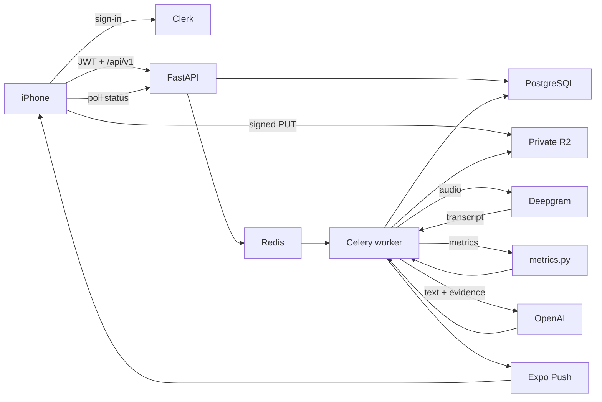

# Brio AI

Daily speaking practice for clearer words and better-structured answers.

Record 15–60 seconds to one prompt. Get feedback on word choice and structure —
not filler words. Progress is against your own history, never a population average.

> **Status:** Production MVP is in development. This repo has a working local
> prototype. The architecture below is the approved target, not what runs today.

## Why

Most people who feel their speaking undersells them do not lack vocabulary. They
struggle to retrieve the precise word in time, and their main point arrives late.
Brio AI trains those two failures.

## How analysis works

1. **Transcribe** — Deepgram receives audio; returns transcript + word timings
2. **Measure** — Python computes every countable metric (never the model)
3. **Coach** — OpenAI receives text + evidence only; never audio

## Production architecture

Invite-only, iPhone-first beta (≤50 testers). Authoritative detail: [PRD.md](PRD.md) §9.



- Phone owns pending audio + encrypted upload outbox
- PostgreSQL owns session/job state; Redis is broker only
- Deepgram alone receives production audio; OpenAI receives text only
- Gemini is development/test only — never customer content

## Current prototype

Recording → synchronous `POST /api/analyze` → Deepgram → `metrics.py` → Gemini.
Sessions and audio stay on the device. No Clerk, PostgreSQL, R2, or Celery yet.

## Run locally

```bash
pnpm install && uv sync
cp .env.example .env   # DEEPGRAM_API_KEY, GEMINI_API_KEY

uv run uvicorn main:app --host 0.0.0.0 --port 8080 --app-dir api --reload
# health: http://localhost:8080/api/healthz

cd mobile
EXPO_PUBLIC_API_URL=http://<LAN-IP>:8080 pnpm dev
```

Use `ipconfig getifaddr en0` for a physical iPhone. Simulator: `http://localhost:8080`.

```
mobile/   Expo app
api/      FastAPI prototype
brand/    Logo and brand kit
docs/     Product and research notes
```

[PRD.md](PRD.md) — product + architecture source of truth  
[CLAUDE.md](CLAUDE.md) — current repo state and engineering notes
